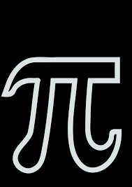
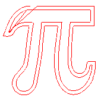
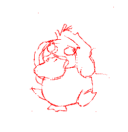
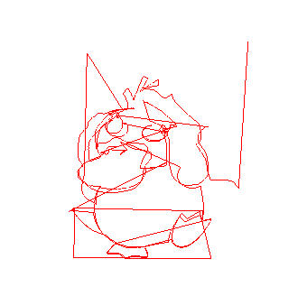
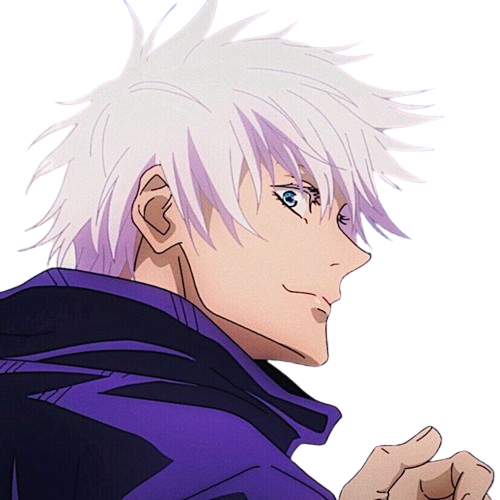
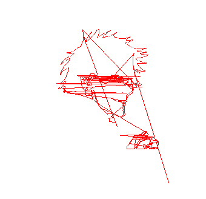

# Application

## Image of PI
Number of contours: 3, Number of points: 581
#### Initial image

#### Result image

## Image of Psyduck
Number of contours: 20, Number of points: 4825
#### Initial image

#### Result image
Without connecting lines

With connecting lines

## Image of Gojo
Number of contours: 123, Number of points: 2844
#### Initial image

#### Result image
Without connecting lines

With connecting lines

