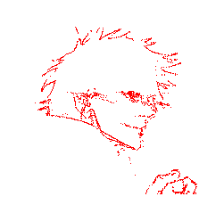

# Application
## How to run
Files with underscore parallel are more parallelized versions of other files. twocoords implements drawing with FFTs on X and Y separately, combined does it together. -top argument specifies filtering of FFT values (how many largest values to keep). Drawing lets you first draw an image and then constructs it using the circles drawing.
```
cd drawing
make drawing
./drawing
make combined
./combined <filename> [-points] [-n <num_threads>] [-top <value>]
make combined_parallel
./combined_parallel <filename> [-points] [-n <num_threads>]
make twocoords
./twocoords <filename> [-points] [-n <num_threads>] [-top <value>]
make twocoords_parallel
./twocoords_parallel <filename> [-points] [-n <num_threads>]
```

#### Dependencies: 
code relies on OpenCV and SFML. You can get it from terminal on Linux (Ubuntu/Debian) by:
```
sudo apt install libopencv-dev
sudo apt install libsfml-dev
```

<div align="center">
  
## Image of PI
Number of contours: 3, Number of points: 581
#### Initial image


#### Result image


## Image of Psyduck
Number of contours: 20, Number of points: 4825
#### Initial image


#### Result image
With connecting lines


Without connecting lines


## Image of Gojo
Number of contours: 123, Number of points: 2844
#### Initial image


#### Result image
With connecting lines


Without connecting lines


</div>
